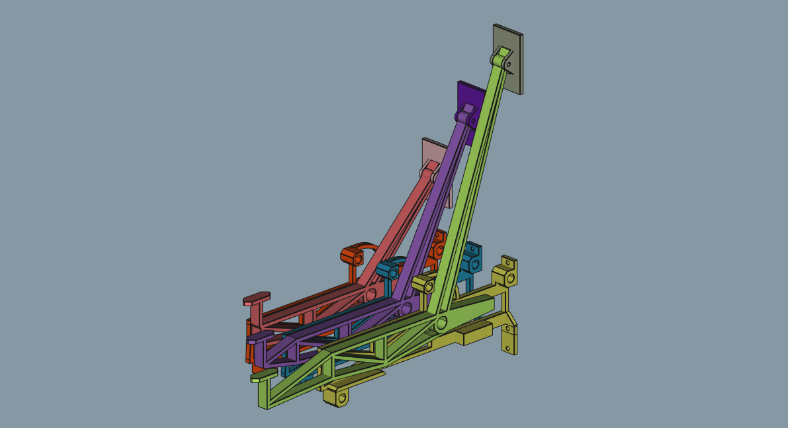
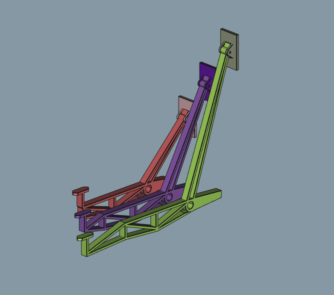
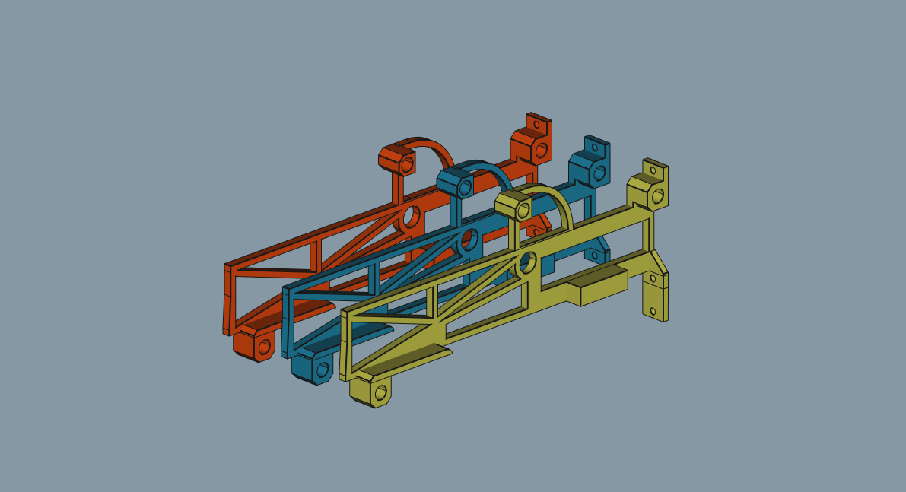
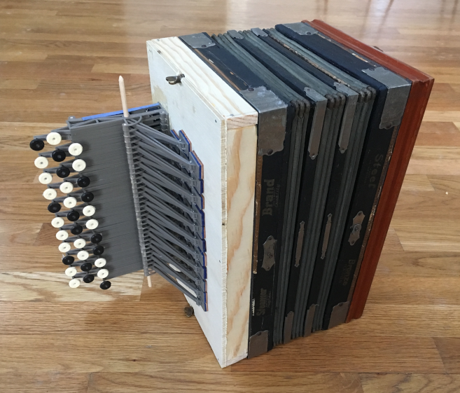

# The Mechanism

An accordion operates by using buttons to open and close air holes that correspond to a given note. The mechanism in the picture above provides buttons arms that lift or lower valves, which are to be placed above holes. This mechanism represents 3 notes of the accordion, and is repeated several times to create a full accordion.

The sides of FDM prints are too rough to provide smooth movement. Therefore, the action must occur between the top and bottom layers of the printed parts. For this reason the mechanism is designed as a sandwich of many stacked levers and frame parts.

A chromatic button accordion uses three rows of buttons. This requires the use of three separate button arm lengths, one per row.

The pallets, which are the valves that close the holes, are printed seperately from the arm and given the freedom to rotate several degrees. This allows them to fully close the hole even in the case of imperfect alignment. The pallets are the off-coloured parts in the picture above.

The bottom of the button arm is angled for perfect contact with the frame when the button is fully pressed. A full press is determined by the press depth at the end of the arm, and so the angle of the bottom of the arm varies for each of the three arm lengths. To provide an identical actuation force for the different arm lengths, the distance of the extension spring from the axis must also vary for each arm.

The frame provides stability and support for the buttom arms. It is composed of parts stacked on three rods, along with the central axle, that provides it with stability. Each frame piece contains a mounting point for the extension spring, and a quarter-circle stabilizer on top that limits the wobble on the buttom arms.

# The Accordion

The mechanism, printed and assembled. It is mounted on a wooden box (with a hole under each pallet), and has 3D printed buttons painted to reflect the corresponding note. It is lacking the central axle for the button arms.

The fully assembled accordion, with the reused bellow.
